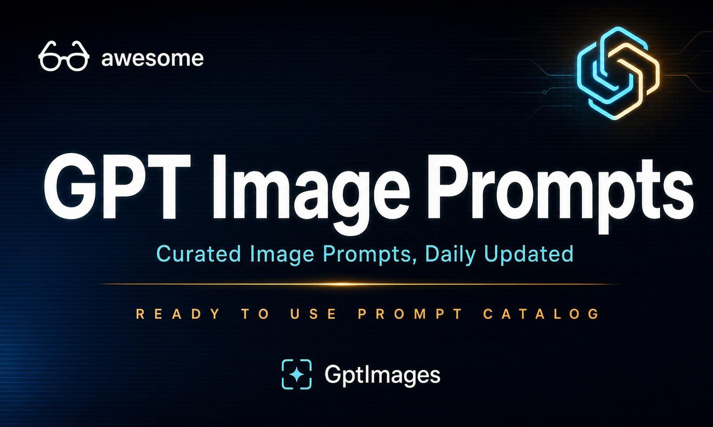
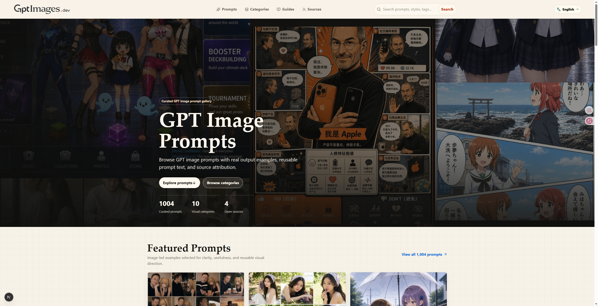

# awesome-image-prompts

Patrones reutilizables de prompts GPT de imagen, normalizados para GitHub, JSON y gptimages.dev.

       

              

  Un catálogo seleccionado, normalizado y multilingüe de prompts GPT de imagen de alta calidad recopilados de proyectos open source. 
  Los archivos Markdown de este repositorio se generan desde los datos públicos estandarizados del catálogo, para que la documentación de GitHub, los JSON exportados y la web estén alineados.

## ✨ Sitio web

  

  

Usa [gptimages.dev](https://gptimages.dev) para explorar, buscar, filtrar y copiar estos prompts. El sitio se basa en este catálogo y es la forma más rápida de descubrir patrones por categoría, idioma y fuente.

<a href="https://gptimages.dev"><strong>Open gptimages.dev</strong></a>

## 📊 Resumen del catálogo

<table>
<tr>
<td align="center"><strong>1,013</strong> Prompts totales</td>
<td align="center"><strong>10</strong> Colecciones</td>
<td align="center"><strong>4</strong> Fuentes upstream</td>
<td align="center"><strong>15</strong> Idiomas</td>
</tr>
</table>

- Generado: 2026-05-06T16:38:26.334Z
- Idiomas:               
- Datos públicos: Los datos del catálogo legibles por máquina están en `data/catalog/`.
- Prompts: Cada prompt completo se genera en los documentos de colección de abajo. El README raíz se mantiene compacto y los archivos divididos conservan el catálogo completo fácil de navegar.

## 🗂️ Data Directory

The `data/` directory is the source of truth for this repository. Human and AI edits live in canonical shards; publishable website data is generated from those shards.

<table>
<tr>
<th align="center">Path</th>
<th align="center">Purpose</th>
</tr>
<tr>
<td align="center">`data/canonical/prompts/`</td>
<td align="center">Per-prompt canonical JSON shards. These preserve stable ids, upstream references, translations, assets, categories, and local edits.</td>
</tr>
<tr>
<td align="center">`data/catalog/`</td>
<td align="center">Localized public JSON exports consumed by websites and downstream tools.</td>
</tr>
<tr>
<td align="center">`data/reports/current.json`</td>
<td align="center">Current validation, warning, and maintenance report for the workbench.</td>
</tr>
<tr>
<td align="center">`data/runs/`</td>
<td align="center">Extraction run history with added, updated, unchanged, warning, and error counts.</td>
</tr>
</table>

## 🧭 Colecciones

<table>
<tr>
<th align="center">Categoría</th>
<th align="center">Cantidad</th>
<th align="center">Abrir</th>
</tr>
<tr>
<td align="center"><a href="docs/es/poster-illustration.md">Poster &amp; Illustration</a></td>
<td align="center">356</td>
<td align="center"><a href="docs/es/poster-illustration.md">Abrir →</a></td>
</tr>
<tr>
<td align="center"><a href="docs/es/ui-social-media.md">UI &amp; Social Media</a></td>
<td align="center">210</td>
<td align="center"><a href="docs/es/ui-social-media.md">Abrir →</a></td>
</tr>
<tr>
<td align="center"><a href="docs/es/photography-portrait.md">Photography &amp; Portrait</a></td>
<td align="center">172</td>
<td align="center"><a href="docs/es/photography-portrait.md">Abrir →</a></td>
</tr>
<tr>
<td align="center"><a href="docs/es/product-marketing.md">Product &amp; Marketing</a></td>
<td align="center">108</td>
<td align="center"><a href="docs/es/product-marketing.md">Abrir →</a></td>
</tr>
<tr>
<td align="center"><a href="docs/es/infographic-education.md">Infographic &amp; Education</a></td>
<td align="center">80</td>
<td align="center"><a href="docs/es/infographic-education.md">Abrir →</a></td>
</tr>
<tr>
<td align="center"><a href="docs/es/character-design.md">Character Design</a></td>
<td align="center">30</td>
<td align="center"><a href="docs/es/character-design.md">Abrir →</a></td>
</tr>
<tr>
<td align="center"><a href="docs/es/architecture-interior.md">Architecture &amp; Interior</a></td>
<td align="center">17</td>
<td align="center"><a href="docs/es/architecture-interior.md">Abrir →</a></td>
</tr>
<tr>
<td align="center"><a href="docs/es/general.md">General</a></td>
<td align="center">17</td>
<td align="center"><a href="docs/es/general.md">Abrir →</a></td>
</tr>
<tr>
<td align="center"><a href="docs/es/comic-story.md">Comic &amp; Story</a></td>
<td align="center">12</td>
<td align="center"><a href="docs/es/comic-story.md">Abrir →</a></td>
</tr>
<tr>
<td align="center"><a href="docs/es/brand-logo.md">Brand &amp; Logo</a></td>
<td align="center">11</td>
<td align="center"><a href="docs/es/brand-logo.md">Abrir →</a></td>
</tr>
</table>

## 🌟 Prompts destacados

Una muestra compacta del catálogo. Abre cualquier colección para leer el texto completo del prompt.

<table>
<tr>
<td align="center" width="33%">
 
<strong><a href="docs/es/ui-social-media.md#prompt-abc95efc8feb9f8cc5c6">Annotated Coffee Table Mood Board</a></strong> 
UI &amp; Social Media
</td>
<td align="center" width="33%">
 
<strong><a href="docs/es/poster-illustration.md#prompt-0093b22034fc6d702ece">Cómic / Guion gráfico - Escena de infiltración de ciencia ficción bajo la lluvia</a></strong> 
Poster &amp; Illustration
</td>
<td align="center" width="33%">
 
<strong><a href="docs/es/photography-portrait.md#prompt-01ea4ab521639902beef">Perfil / Avatar - Retrato de doble exposición con ambiente carmesí</a></strong> 
Photography &amp; Portrait
</td>
</tr>
<tr>
<td align="center" width="33%">
 
<strong><a href="docs/es/poster-illustration.md#prompt-02a3e51e87b0ecc220fc">Activo de juego - Interfaz de lobby de juego de cartas de anime</a></strong> 
Poster &amp; Illustration
</td>
<td align="center" width="33%">
 
<strong><a href="docs/es/photography-portrait.md#prompt-02dd9304d0c16ac57f17">Perfil / Avatar - Serie de fotos de chica con uvas en verano</a></strong> 
Photography &amp; Portrait
</td>
<td align="center" width="33%">
 
<strong><a href="docs/es/poster-illustration.md#prompt-0325b44927db2112e613">Cómic / Guion gráfico - Escena de camiseta con perro en el campo estilo anime</a></strong> 
Poster &amp; Illustration
</td>
</tr>
</table>

## 🧰 What You Get

<table>
<tr>
<th align="center">Feature</th>
<th align="center">Details</th>
</tr>
<tr>
<td align="center">🖼️ Visual gallery</td>
<td align="center">Image-led browsing with real GPT image outputs.</td>
</tr>
<tr>
<td align="center">✍️ Copy-ready prompts</td>
<td align="center">Reusable prompt text is preserved in collection documents.</td>
</tr>
<tr>
<td align="center">🔗 Source attribution</td>
<td align="center">Every catalog item keeps upstream repository references.</td>
</tr>
<tr>
<td align="center">🌐 Multilingual catalog</td>
<td align="center">Localized README and JSON outputs use available translations and fall back to the default prompt text when needed.</td>
</tr>
</table>

## 📦 Contrato de datos

- `data/catalog/manifest.json`
- `data/catalog/prompts.<lang>.json`
- `data/catalog/search.<lang>.json`
- `data/catalog/taxonomy.json`

## 🔗 Fuentes upstream

- freestylefly/awesome-gpt-image-2: 372
- EvoLinkAI/awesome-gpt-image-2-prompts: 362
- YouMind-OpenLab/awesome-gpt-image-2: 222
- ZeroLu/awesome-gpt-image: 79

## ⚡ Quick Start

Use pnpm scripts for repeatable ingestion, validation, export, README generation, and local review.

<table>
<tr>
<th align="center">Command</th>
<th align="center">Purpose</th>
</tr>
<tr>
<td align="center">`pnpm install`</td>
<td align="center">Install dependencies.</td>
</tr>
<tr>
<td align="center">`pnpm ingest`</td>
<td align="center">Parse configured upstream repositories, merge records, and preserve existing local edits.</td>
</tr>
<tr>
<td align="center">`pnpm validate`</td>
<td align="center">Validate canonical prompt data and refresh the current report.</td>
</tr>
<tr>
<td align="center">`pnpm translate -- --language zh-CN`</td>
<td align="center">Fill missing translations with the configured AI provider.</td>
</tr>
<tr>
<td align="center">`pnpm classify`</td>
<td align="center">Map upstream categories into canonical categories and surface unresolved cases.</td>
</tr>
<tr>
<td align="center">`pnpm assets:mirror`</td>
<td align="center">Mirror missing remote assets into the local asset cache.</td>
</tr>
<tr>
<td align="center">`pnpm catalog:export -- --languages all`</td>
<td align="center">Export localized JSON catalog files from canonical data.</td>
</tr>
<tr>
<td align="center">`pnpm readme:generate -- --languages all`</td>
<td align="center">Regenerate README files and split collection documents.</td>
</tr>
<tr>
<td align="center">`pnpm workbench`</td>
<td align="center">Start the local maintenance workbench.</td>
</tr>
<tr>
<td align="center">`pnpm test`</td>
<td align="center">Run the ingestion, catalog, workbench, and README test suite.</td>
</tr>
</table>

After `pnpm workbench`, open `http://127.0.0.1:4173` to review warnings, batch translate, classify, export catalog data, and regenerate README files.

## 🤝 How to Contribute

Contributions are welcome when they keep the catalog stable, traceable, and reviewable.

- Add or adjust upstream parsers under `scripts/ingestion/sources/`.
- Keep canonical ids stable and preserve existing human or AI translations.
- Run `pnpm test` before submitting generated catalog or README changes.
- Include source attribution for every imported prompt and preview asset.

## 👥 Contributors

Thanks to everyone who adds adapters, improves taxonomy rules, translates prompts, validates upstream changes, or reviews catalog quality.

## 📄 License

Prompt text, preview images, and upstream metadata keep their original upstream ownership and license terms. Repository scripts and generated catalog structure are provided for cataloging and educational use; please keep source attribution when reusing the data.
